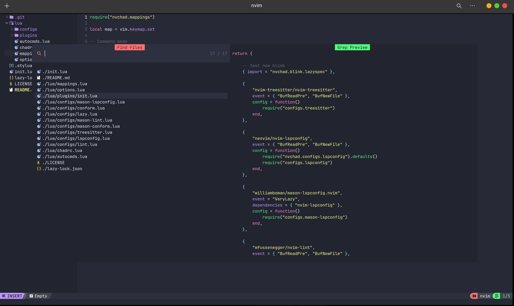

# 🛠️ MyNvim-config

This is my personal Neovim configuration built on top of [NvChad](https://github.com/NvChad/NvChad) — a blazingly fast and extensible Neovim config framework.

> **Note:** This repo is meant to be used **with NvChad**. It acts as a custom layer on top of the core NvChad setup.

---

## 🚀 Features

- 🧞 Custom key mappings and UI tweaks
- 💡 LSP, autocompletion, and formatting configured to my workflow
- 🎨 Theming, transparency, and icons customized
- ⚙️ Extended plugin support (Telescope, Treesitter, Mason, and more)

---
## 🖼️ Preview


---
## 📦 Setup Instructions

1. **Install [NvChad](https://github.com/NvChad/NvChad):**

```bash
git clone https://github.com/NvChad/NvChad ~/.config/nvim --depth 1
